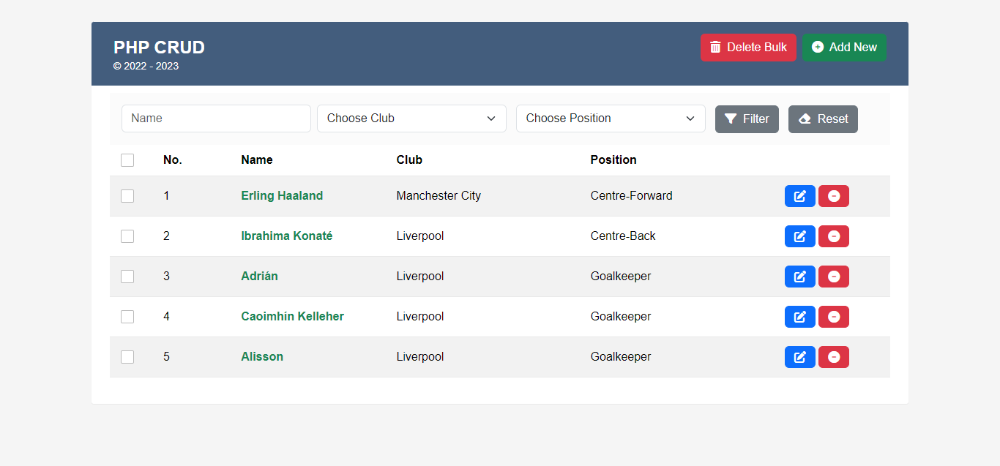

# PHP-CRUD - Simple CRUD for PHP

### How to build it?

**Step 01:**  
Access "data/init.sql" file for creating database and insert data demo.

**Step 02:**  
Access "backend/conn.php" file for configuring database connection.

**Step 03:**  
Browse http://locahost/php-crud and enjoy it!

## Demo

